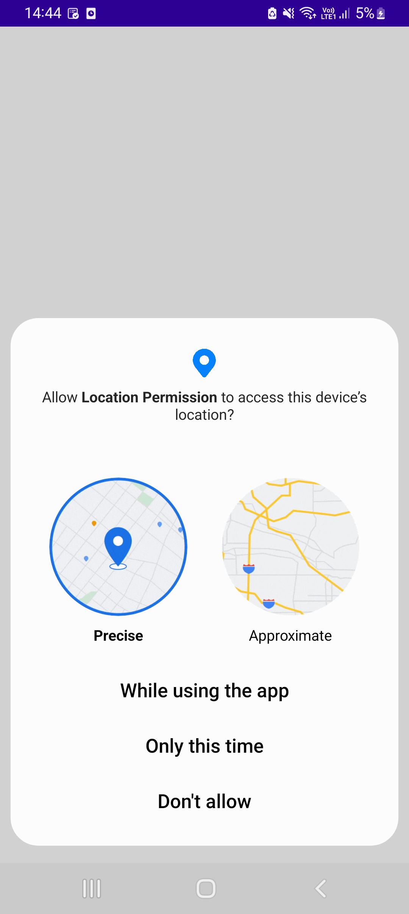
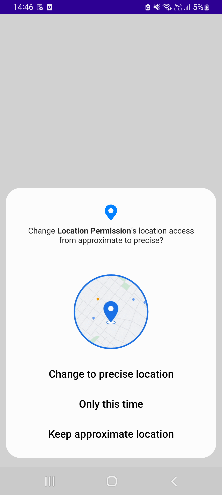

# LocationPermission

Here is the Demo for the Location Permission in All Android Versions

I have tested with multiple scenarios , here is the scenario list

1. Android 8 to 12 tested
2. If permission given and location not enabled
3. If permission deny two times (According to the rule changes from  Android 11)
4. If permission denied
5. Programmatically Enabled Location Permission

<!---->

  
  
  

